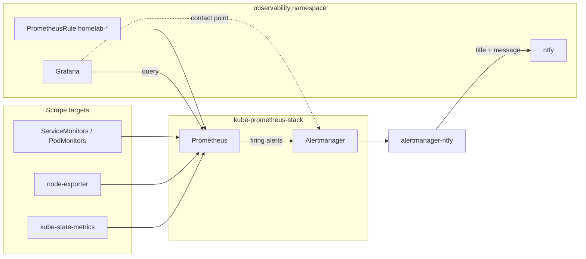

# Homelab observability (GitOps)

This stack wires **Prometheus** (metrics + alert rules), **Alertmanager** (notifications), and **Grafana** (dashboards + optional UI alerting) entirely from Git.

## Architecture



| Layer | Location | Purpose |
|-------|----------|---------|
| Default K8s alerts | `kube-prometheus-stack` Helm chart | Node, pod, PVC, API, etc. |
| Homelab alerts | `prometheus-rules/app/*.yaml` | Custom PromQL you own |
| Notifications | `alertmanager-ntfy/` + `alertmanagerconfig.yaml` | Formats alerts → ntfy topic `homelab-alerts` |
| Dashboards | `grafana/app/grafana-dashboards-values.configmap.yaml` | TrueCharts marketplace IDs |
| Grafana ↔ AM | `grafana/app/helm-release.yaml` (`configmap.grafana-alerting-provisioning`) | Unified alerting contact point |

## ntfy (push notifications)

Self-hosted **ntfy** runs in this namespace (`ntfy/app/helm-release.yaml`).

| URL | Use |
|-----|-----|
| `https://ntfy.${DOMAIN_0}` | Web UI, mobile app subscription |
| `https://ntfy.${DOMAIN_0}/homelab-alerts` | Subscribe to alert topic |
| `http://ntfy.observability.svc.cluster.local:10222/homelab-alerts` | Alertmanager webhook (in-cluster) |

**After deploy**

1. Install the [ntfy app](https://ntfy.sh/docs/install/) on your phone.
2. Add server: `https://ntfy.<your-domain>` (same host as ingress).
3. Subscribe to topic **`homelab-alerts`**.
4. Test:

   ```bash
   curl -d "Homelab ntfy test" https://ntfy.<your-domain>/homelab-alerts
   ```

**alertmanager-ntfy** formats webhook payloads into readable ntfy **title**, **message**, priority, and tags.

**Notification tap links:** `X-Click` uses each alert’s `runbook_url` when present (works on your phone). Otherwise it opens `https://grafana.${DOMAIN_0}/`. Built-in Prometheus `GeneratorURL` links use the in-cluster Service DNS (`kube-prometheus-stack-prometheus...`) and are intentionally not used.

| Source | Path |
|--------|------|
| Grafana alerts & **Test** button | Contact point **ntfy (homelab)** → webhook → alertmanager-ntfy → ntfy |
| Prometheus / cluster alerts | Alertmanager → webhook → alertmanager-ntfy → ntfy |

Use contact point **ntfy (homelab)** in Grafana rules and when clicking **Test** on a contact point. Do not use the old “Alertmanager (homelab)” / external-Alertmanager contact point for ntfy—that path does not deliver Grafana test notifications reliably.

Edit templates in `alertmanager-ntfy/app/configmap.yaml` (`templates.title` / `templates.description`). No `clusterenv` secret is required for the default unauthenticated setup.

**Enable auth later:** set `ENABLE_AUTH_FILE: true` in the ntfy Helm values, create users with `ntfy user add`, then add bearer token auth to `alertmanagerconfig.yaml`.

`cert-manager` ServiceMonitor is enabled so `HomelabCertificateExpiringSoon` can evaluate (see `homelab-gitops.yaml`).

Verify alerting pipeline:

```bash
kubectl get pods -n observability -l app.kubernetes.io/name=ntfy
kubectl get alertmanager -n kube-prometheus-stack
kubectl get pods -n kube-prometheus-stack -l app.kubernetes.io/name=alertmanager
```

## Add a new Prometheus alert (recommended)

Prometheus rules are the primary alert source for this cluster. Grafana displays them; Alertmanager notifies.

1. Copy `prometheus-rules/app/_template.prometheus-rule.yaml` → `prometheus-rules/app/homelab-<name>.yaml`
2. Uncomment and edit the rule (PromQL, `for`, labels, annotations)
3. Add the filename to `prometheus-rules/app/kustomization.yaml`
4. Commit and push

**Labels**

- `severity: warning | critical` — used by Alertmanager inhibit rules (critical suppresses warning for same alert+namespace)
- `homelab_team: <name>` — optional; use in AlertmanagerConfig `routes` if you split webhooks later

**Test in Prometheus UI** (port-forward or in-cluster): Status → Rules, Alerts.

## Add a Grafana marketplace dashboard

Edit `grafana/app/grafana-dashboards-values.configmap.yaml` under `dashboards.grafana`:

```yaml
my-dashboard-12345:
  enabled: true
  failOnError: false
  b64content: false
  datasource:
    - name: $${DS_PROMETHEUS}
      value: Prometheus
  marketplace:
    id: 12345
    revision: 1
```

Find IDs at [grafana.com/grafana/dashboards](https://grafana.com/grafana/dashboards/). Datasource substitution must use `Prometheus` (matches `helm-release.yaml`).

## Add a Grafana-managed alert (optional)

Grafana alerting file provisioning lives in `helm-release.yaml` under `configmap.grafana-alerting-provisioning.data` (same pattern as the Prometheus datasource). Export rules from Grafana UI (Alerting → Export) or follow [Grafana file provisioning](https://grafana.com/docs/grafana/latest/alerting/set-up/provision-alerting-resources/file-provisioning/).

Prefer **PrometheusRule** for infrastructure alerts so firing state is consistent in Prometheus, Alertmanager, and Grafana.

## Flux / GitOps alerts

Flux was not exporting metrics until wired up in two places:

| Component | Location | Purpose |
|-----------|----------|---------|
| PodMonitor | `flux-system/monitoring/podmonitor.yaml` | Scrapes helm/kustomize/source-controller metrics |
| kube-state-metrics | `system/kube-prometheus-stack/app/kube-state-metrics-flux-values.configmap.yaml` | `gotk_resource_info` for HelmRelease, Kustomization, sources |

Prometheus rules: `prometheus-rules/app/homelab-flux.yaml`

| Alert | Meaning |
|-------|---------|
| `HomelabFluxHelmReleaseNotReady` | Helm install/upgrade or chart problem (10m); summary includes `namespace/release` and **chart** from GitOps spec |
| `HomelabFluxKustomizationNotReady` | Kustomize apply failing (15m) |
| `HomelabFluxSourceNotReady` | Git/OCI/Helm repo or chart not ready |
| `HomelabFluxControllerReconcileErrors` | Controller error rate in `flux-system` |
| `HomelabFluxHelmReconcileSlow` | helm-controller p99 reconcile > 5m |

After deploy, verify metrics exist:

```bash
# Resource state (from kube-state-metrics)
kubectl exec -n kube-prometheus-stack prometheus-kube-prometheus-stack-0 -c prometheus -- \
  wget -qO- 'http://localhost:9090/api/v1/query?query=gotk_resource_info' | head -c 500

# Controller metrics (from PodMonitor)
kubectl get podmonitor -n flux-system
```

Tune `for:` durations in `homelab-flux.yaml` if Flux reconciliation legitimately runs longer than the alert window.

### `PrometheusDuplicateTimestamps` (kube-state-metrics)

If you see **“Prometheus is dropping samples with duplicate timestamps”**, check Prometheus logs — drops often come from **`serviceMonitor/.../kube-state-metrics`**, not from Prometheus self-metrics. Common causes after enabling Flux `gotk_resource_info`:

- Mis-indented `labelsFromPath` in `kube-state-metrics-flux-values.configmap.yaml` (must match [Flux custom metrics](https://fluxcd.io/flux/monitoring/custom-metrics/) — metric-level `labelsFromPath`, not duplicated under `info`)
- Volatile Info labels on HelmRelease (`chart_name`, etc.) that change every reconcile

Homelab config keeps stable labels only (`ready`, `suspended`, `name`, `exported_namespace`) and sets `honorTimestamps: false` on the kube-state-metrics ServiceMonitor. After deploy, the alert should clear within ~15m. Runbook: [PrometheusDuplicateTimestamps](https://runbooks.prometheus-operator.dev/runbooks/prometheus/prometheusduplicatetimestamps).

### Practical alert test (broken HelmRelease)

See **`alert-test/README.md`**. A deliberate `alert-test-fail` HelmRelease (nonexistent chart) plus `HomelabFluxHelmReleaseTestFail` (2m `for`) lets you verify ntfy without waiting 10 minutes. Remove `alert-test/` and `homelab-flux-test.yaml` when done.

## Silence noise

- **Watchdog** / **InfoInhibitor**: routed to `null` receiver (pipeline health only).
- **TargetDown** on apps without metrics: fix ServiceMonitor or increase `for` in a homelab rule (see `homelab-downloaders.yaml`).
- Temporary: Alertmanager UI (port-forward svc) or Grafana silences.

## Key files

| File | Change when |
|------|-------------|
| `system/kube-prometheus-stack/app/helm-release.yaml` | Enable/tune Prometheus/Alertmanager |
| `system/kube-prometheus-stack/app/alertmanagerconfig.yaml` | Routing, receivers, inhibit rules |
| `prometheus-rules/app/*.yaml` | New homelab PromQL alerts (incl. `homelab-flux.yaml`) |
| `flux-system/monitoring/podmonitor.yaml` | Flux controller scrape config |
| `system/kube-prometheus-stack/app/kube-state-metrics-flux-values.configmap.yaml` | Flux CR metrics for alerting |
| `grafana/app/grafana-dashboards-values.configmap.yaml` | New dashboards |
| `grafana/app/helm-release.yaml` (alerting `configmap` block) | Grafana contact points / policies |
| `ntfy/app/helm-release.yaml` | ntfy server, ingress, persistence |
| `alertmanager-ntfy/app/configmap.yaml` | Alert title/message templates, priority, tags |
