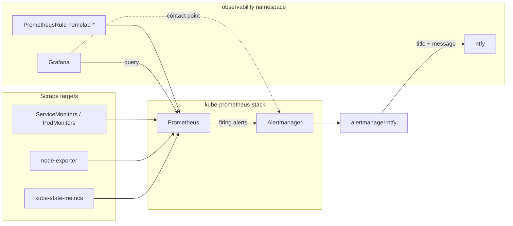

# Homelab observability (GitOps)

This stack wires **Prometheus** (metrics + alert rules), **Alertmanager** (notifications), and **Grafana** (dashboards + optional UI alerting) entirely from Git.

## Architecture



| Layer | Location | Purpose |
|-------|----------|---------|
| Default K8s alerts | `kube-prometheus-stack` Helm chart | Node, pod, PVC, API, etc. |
| Homelab alerts | `prometheus-rules/app/*.yaml` | Custom PromQL you own |
| Notifications | `alertmanager-ntfy/` + `alertmanagerconfig.yaml` | Formats alerts → ntfy topic `homelab-alerts` |
| Dashboards | `grafana/app/grafana-dashboards-values.configmap.yaml` | TrueCharts marketplace IDs |
| Grafana ↔ AM | `grafana/app/helm-release.yaml` (`configmap.grafana-alerting-provisioning`) | Unified alerting contact point |

## ntfy (push notifications)

Self-hosted **ntfy** runs in this namespace (`ntfy/app/helm-release.yaml`).

| URL | Use |
|-----|-----|
| `https://ntfy.${DOMAIN_0}` | Web UI, mobile app subscription |
| `https://ntfy.${DOMAIN_0}/homelab-alerts` | Subscribe to alert topic |
| `http://ntfy.observability.svc.cluster.local:10222/homelab-alerts` | Alertmanager webhook (in-cluster) |

**After deploy**

1. Install the [ntfy app](https://ntfy.sh/docs/install/) on your phone.
2. Add server: `https://ntfy.<your-domain>` (same host as ingress).
3. Subscribe to topic **`homelab-alerts`**.
4. Test:

   ```bash
   curl -d "Homelab ntfy test" https://ntfy.<your-domain>/homelab-alerts
   ```

**alertmanager-ntfy** formats webhook payloads into readable ntfy **title**, **message**, priority, and tags.

**ntfy notification actions** (configured in `alertmanager-ntfy/app/configmap.yaml`):

| Action | Header | Opens |
|--------|--------|--------|
| Tap notification | `X-Click` | `https://ntfy.<domain>/homelab-alerts` (topic in the ntfy app) |
| **Ask AI** button | `X-Actions` | [Hermes WebUI](mk_hermes-oncall.md) `https://hermes.<domain>/?incident=<fingerprint>` |
| **Runbook** button | `X-Actions` | `runbook_url` annotation, else [prometheus-operator runbooks](https://runbooks.prometheus-operator.dev/) |
| **Alert** button | `X-Actions` | Grafana Alerting list filtered by `alertname` |
| **Dashboard** button | `X-Actions` | Only when the rule sets `dashboard_url` (homelab rules) |

Do **not** use Prometheus `GeneratorURL` in ntfy headers — it points at in-cluster DNS (`kube-prometheus-stack-prometheus...`) and is unreachable from your phone.

Optional annotations on PrometheusRule alerts:

```yaml
annotations:
  runbook_url: https://docs.${DOMAIN_0}/main/kubernetes/.../mk_runbook_.../
  dashboard_url: https://grafana.${DOMAIN_0}/d/<uid-or-slug>
```

| Source | Path |
|--------|------|
| Grafana alerts & **Test** button | Contact point **ntfy (homelab)** → **homelab-alert-bridge** → alertmanager-ntfy → ntfy |
| Prometheus / cluster alerts | Alertmanager → **homelab-alert-bridge** → alertmanager-ntfy → ntfy |
| **Ask AI** / incident JSON | [Hermes on-call](mk_hermes-oncall.md) + `homelab-alert-bridge` |

Use contact point **ntfy (homelab)** in Grafana rules and when clicking **Test** on a contact point. Do not use the old “Alertmanager (homelab)” / external-Alertmanager contact point for ntfy—that path does not deliver Grafana test notifications reliably.

Edit templates in `alertmanager-ntfy/app/configmap.yaml` (`templates.title` / `templates.description`). No `clusterenv` secret is required for the default unauthenticated setup.

**Enable auth later:** set `ENABLE_AUTH_FILE: true` in the ntfy Helm values, create users with `ntfy user add`, then add bearer token auth to `alertmanagerconfig.yaml`.

`cert-manager` ServiceMonitor is enabled so `HomelabCertificateExpiringSoon` can evaluate (see `homelab-gitops.yaml`).

Verify alerting pipeline:

```bash
kubectl get pods -n observability -l app.kubernetes.io/name=ntfy
kubectl get alertmanager -n kube-prometheus-stack
kubectl get pods -n kube-prometheus-stack -l app.kubernetes.io/name=alertmanager
```

## Add a new Prometheus alert (recommended)

Prometheus rules are the primary alert source for this cluster. Grafana displays them; Alertmanager notifies.

1. Copy `prometheus-rules/app/_template.prometheus-rule.yaml` → `prometheus-rules/app/homelab-<name>.yaml`
2. Uncomment and edit the rule (PromQL, `for`, labels, annotations)
3. Add the filename to `prometheus-rules/app/kustomization.yaml`
4. Commit and push

**Labels**

- `severity: warning | critical` — used by Alertmanager inhibit rules (critical suppresses warning for same alert+namespace)
- `homelab_team: <name>` — optional; use in AlertmanagerConfig `routes` if you split webhooks later

**Test in Prometheus UI** (port-forward or in-cluster): Status → Rules, Alerts.

## Alert runbooks

Runbooks are MkDocs pages under `documentation/kubernetes/my-apps/observability/runbooks/`. ntfy **Runbook** buttons use `runbook_url` on the PrometheusRule.

**Freshness:** each page shows **Last updated (Git)**. **Home → Site build info** shows when the cluster image was built. If ntfy opens a 404, the runbook may exist in Git but `homelab-docs` has not been rebuilt or pulled yet.

1. Copy `documentation/kubernetes/my-apps/observability/runbooks/mk_runbook_template.md` → `mk_runbook_<alert-kebab>.md` in the same folder
2. Set `alertname` and optional `alertnames` (multiple alerts, one runbook file)
3. Get the URL: `python scripts/runbook_url.py YourAlertName` (must match an existing file)
4. Add `runbook_url: https://docs.${DOMAIN_0}/...` to the alert annotations (Flux substitutes `${DOMAIN_0}`)
5. Commit — the runbook index table is regenerated at build time

**Service ties**

| Mechanism | Use |
|-----------|-----|
| `releases: [namespace/name]` in runbook front matter | Alert runbook linked on that service’s HelmRelease doc page |
| `areas: [downloaders]` | Runbook linked for every app under that `my-apps` folder |
| `scope: all-helmreleases` | Platform runbook linked on all HelmRelease pages |
| `documentation/kubernetes/my-apps/<workload>/app/mk_runbook.md` | On-call steps for one chart only (not alert-specific) |

## Add a Grafana marketplace dashboard

Edit `grafana/app/grafana-dashboards-values.configmap.yaml` under `dashboards.grafana`:

```yaml
my-dashboard-12345:
  enabled: true
  failOnError: false
  b64content: false
  datasource:
    - name: $${DS_PROMETHEUS}
      value: Prometheus
  marketplace:
    id: 12345
    revision: 1
```

Find IDs at [grafana.com/grafana/dashboards](https://grafana.com/grafana/dashboards/). Datasource substitution must use `Prometheus` (matches `helm-release.yaml`).

## Add a Grafana-managed alert (optional)

Grafana alerting file provisioning lives in `helm-release.yaml` under `configmap.grafana-alerting-provisioning.data` (same pattern as the Prometheus datasource). Export rules from Grafana UI (Alerting → Export) or follow [Grafana file provisioning](https://grafana.com/docs/grafana/latest/alerting/set-up/provision-alerting-resources/file-provisioning/).

Prefer **PrometheusRule** for infrastructure alerts so firing state is consistent in Prometheus, Alertmanager, and Grafana.

## Flux / GitOps alerts

Flux was not exporting metrics until wired up in two places:

| Component | Location | Purpose |
|-----------|----------|---------|
| PodMonitor | `flux-system/monitoring/podmonitor.yaml` | Scrapes helm/kustomize/source-controller metrics |
| kube-state-metrics | `system/kube-prometheus-stack/app/kube-state-metrics-flux-values.configmap.yaml` | `gotk_resource_info` for HelmRelease, Kustomization, sources |

Prometheus rules: `prometheus-rules/app/homelab-flux.yaml`

| Alert | Meaning |
|-------|---------|
| `HomelabFluxHelmReleaseNotReady` | Helm install/upgrade or chart problem (10m); summary includes `namespace/release` and **chart** from GitOps spec |
| `HomelabFluxKustomizationNotReady` | Kustomize apply failing (15m) |
| `HomelabFluxSourceNotReady` | Git/OCI/Helm repo or chart not ready |
| `HomelabFluxControllerReconcileErrors` | Controller error rate in `flux-system` |
| `HomelabFluxHelmReconcileSlow` | helm-controller p99 reconcile > 5m |

After deploy, verify metrics exist:

```bash
# Resource state (from kube-state-metrics)
kubectl exec -n kube-prometheus-stack prometheus-kube-prometheus-stack-0 -c prometheus -- \
  wget -qO- 'http://localhost:9090/api/v1/query?query=gotk_resource_info' | head -c 500

# Controller metrics (from PodMonitor)
kubectl get podmonitor -n flux-system
```

Tune `for:` durations in `homelab-flux.yaml` if Flux reconciliation legitimately runs longer than the alert window.

### `PrometheusDuplicateTimestamps` (kube-state-metrics)

If you see **“Prometheus is dropping samples with duplicate timestamps”**, check Prometheus logs — drops often come from **`serviceMonitor/.../kube-state-metrics`**, not from Prometheus self-metrics. Common causes after enabling Flux `gotk_resource_info`:

- Mis-indented `labelsFromPath` in `kube-state-metrics-flux-values.configmap.yaml` (must match [Flux custom metrics](https://fluxcd.io/flux/monitoring/custom-metrics/) — metric-level `labelsFromPath`, not duplicated under `info`)
- Volatile Info labels on HelmRelease (`chart_name`, etc.) that change every reconcile

Homelab config keeps stable labels only (`ready`, `suspended`, `name`, `exported_namespace`) and sets `honorTimestamps: false` on the kube-state-metrics ServiceMonitor. After deploy, the alert should clear within ~15m. Runbook: [PrometheusDuplicateTimestamps](https://runbooks.prometheus-operator.dev/runbooks/prometheus/prometheusduplicatetimestamps).

### Practical alert test (broken HelmRelease)

See **`documentation/kubernetes/my-apps/observability/alert-test/mk_alert-test.md`**. A deliberate `alert-test-fail` HelmRelease (nonexistent chart) plus `HomelabFluxHelmReleaseTestFail` (2m `for`) lets you verify ntfy without waiting 10 minutes. Remove `alert-test/` and `homelab-flux-test.yaml` when done.

## Using kube-prometheus-stack default alerts (with ntfy)

The chart ships dozens of **PrometheusRule** groups (node, kubelet, workloads, storage, API, etc.). You do **not** need a separate Grafana contact point for them.

### Do default alerts reach ntfy?

**Yes, for almost all of them**, when Alertmanager marks them **Active**:

```text
Prometheus (default rules) → Alertmanager → homelab-alert-bridge → alertmanager-ntfy → homelab-alerts
```

Your `alertmanagerconfig.yaml` default receiver is **`homelab-webhook`**. Only a few names are routed to **`null`** on purpose (see [Silence noise](#silence-noise) below). Everything else—including `KubePodCrashLooping`, `KubePersistentVolumeFillingUp`, `NodeFilesystemAlmostOutOfSpace`, etc.—uses the same ntfy path as homelab rules.

Grafana **Alerting** can *display* firing Prometheus rules without you getting a push. If ntfy is quiet, check **Alertmanager**, not only Grafana:

```bash
kubectl port-forward -n kube-prometheus-stack svc/kube-prometheus-stack-alertmanager 9093:9093
# http://127.0.0.1:9093 — Active vs Suppressed vs Unprocessed
```

Confirm the pipeline after changes:

```bash
curl -d "ntfy pipeline test" https://ntfy.<your-domain>/homelab-alerts
flux get helmrelease homelab-flux-test-fail -n observability   # or alert-test harness
```

Built-in rules often include **`runbook_url`** (prometheus-operator runbooks). **alertmanager-ntfy** uses that annotation for the ntfy tap link when present.

### Recommended approach (homelab)

Work in three layers—do not try to “enable” defaults globally; they are already on.

| Layer | What to do |
|-------|------------|
| **1. Keep** | High-signal defaults: pod crash loop, PVC almost full, node disk/memory pressure, API errors, `KubeJobFailed`, cert issues (plus your **`homelab-*`** rules for Flux, certs, etc.). |
| **2. Tune or silence** | Noisy defaults: **`TargetDown`** (scrape blips), **`KubeJobNotCompleted`** (long Jobs), CPUThrottling on batch work, alerts for components you do not run. Use chart `defaultRules.disabled` / `customRules` in `system/kube-prometheus-stack/app/helm-release.yaml`, or **`null` routes** in `alertmanagerconfig.yaml` (same pattern as Watchdog / downloaders / ollama). |
| **3. Homelab replacements** | Where a default rule is too blunt, add a **narrower** `homelab-*.yaml` rule and **suppress** the default for that case (see `homelab-downloaders.yaml`, `homelab-ai.yaml`). |

### Tune defaults in GitOps (examples)

In `kube-prometheus-stack` Helm `values` (not committed yet unless you add):

```yaml
defaultRules:
  # disabled:
  #   TargetDown: true
  #   KubeCPUOvercommit: true
  customRules:
    TargetDown:
      for: 30m
    KubeJobNotCompleted:
      for: 24h
```

`disabled` turns a rule off cluster-wide. `customRules` only changes `for` / `severity` on that alert name.

### Optional: route by severity in Alertmanager

Today **warning** and **critical** both go to ntfy (critical inhibits warning for the *same* `alertname` + `namespace`). To page harder on critical only, add child routes in `alertmanagerconfig.yaml`, e.g. warnings with longer `repeatInterval` or a separate topic—only after you audit what fires.

### Add homelab value on top

| Need | Action |
|------|--------|
| Flux / GitOps | Already: `homelab-flux.yaml` |
| App-specific scrape down | Pattern: `homelab-downloaders.yaml` + suppress `TargetDown` in that namespace |
| Long bootstrap Jobs | Pattern: `homelab-ai.yaml` + suppress `KubeJobNotCompleted` for that `job_name` |
| Your own SLOs | New `prometheus-rules/app/homelab-<team>.yaml` + runbook under `documentation/kubernetes/my-apps/observability/runbooks/` |

Prioritize **runbooks** only for alerts you actually respond to; defaults already link to [prometheus-operator runbooks](https://runbooks.prometheus-operator.dev/) when the chart sets `runbook_url`.

### Audit what is firing (one-time)

```bash
kubectl exec -n kube-prometheus-stack deploy/kube-prometheus-stack-prometheus -c prometheus -- \
  wget -qO- 'http://localhost:9090/api/v1/alerts' | jq -r '
    .data.alerts[]
    | select(.state=="firing")
    | [.labels.alertname, .labels.severity, .labels.namespace]
    | @tsv' | sort -u
```

For each row: **fix**, **disable** (`defaultRules.disabled`), **suppress** (`null` route), or **replace** (homelab rule)—then commit.

## Silence noise

- **Watchdog** / **InfoInhibitor**: routed to `null` receiver (pipeline health only).
- **TargetDown** in `downloaders`: suppressed in Alertmanager; use **`HomelabDownloaderMetricsDown`** (`homelab-downloaders.yaml`, 20m on `service=*-metrics`) for ntfy instead.
- **TargetDown** elsewhere: fix ServiceMonitor or disable via kube-prometheus-stack `defaultRules.disabled.TargetDown`.
- **KubeJobNotCompleted** for `ollama-model-pull-job`: suppressed; use **`HomelabOllamaModelPullStuck`** (36h, `homelab-ai.yaml`) or delete the Job after a successful pull.
- **KubeJobFailed** for `ollama-model-pull-job`: suppressed; use **`HomelabKubeJobFailedOllamaModelPull`** (`homelab-ai.yaml`) with homelab runbook link on ntfy.
- Temporary: Alertmanager UI (port-forward svc) or Grafana silences.

## Key files

| File | Change when |
|------|-------------|
| `system/kube-prometheus-stack/app/helm-release.yaml` | Enable/tune Prometheus/Alertmanager |
| `system/kube-prometheus-stack/app/alertmanagerconfig.yaml` | Routing, receivers, inhibit rules |
| `prometheus-rules/app/*.yaml` | New homelab PromQL alerts (incl. `homelab-flux.yaml`) |
| `flux-system/monitoring/podmonitor.yaml` | Flux controller scrape config |
| `system/kube-prometheus-stack/app/kube-state-metrics-flux-values.configmap.yaml` | Flux CR metrics for alerting |
| `grafana/app/grafana-dashboards-values.configmap.yaml` | New dashboards |
| `grafana/app/helm-release.yaml` (alerting `configmap` block) | Grafana contact points / policies |
| `ntfy/app/helm-release.yaml` | ntfy server, ingress, persistence |
| `alertmanager-ntfy/app/configmap.yaml` | Alert title/message templates, priority, tags |
